# Microservices DevOps 

## Présentation

Ce projet est la continuité des TPs 01 à 06 du cours DevOps. L'architecture de base (frontend Next.js, auth-service FastAPI, order-service NestJS) a été conservée et enrichie avec un nouveau microservice : le **recipe-service**, développé en NestJS avec Prisma et SQLite, qui intègre l'API publique TheMealDB pour permettre à un utilisateur authentifié de rechercher des recettes de cuisine et de les sauvegarder dans ses favoris.


## Architecture

Le frontend Next.js joue le rôle d'API Gateway : il intercepte toutes les requêtes du navigateur, lit le cookie JWT httpOnly côté serveur et les transmet aux services concernés. Le token JWT n'est jamais exposé au navigateur. Le auth-service génère les tokens JWT et les signe avec une clé secrète `JWT_SECRET`. Le order-service et le recipe-service utilisent cette même clé pour vérifier les tokens eux-mêmes.

## API publique — TheMealDB

Le recipe-service utilise l'API publique TheMealDB (https://www.themealdb.com/api.php). Elle est totalement gratuite et ne nécessite aucune clé API. Depuis la page `/recipes`, l'utilisateur tape un mot-clé (ex: "chicken", "pasta"), le frontend appelle `/api/recipes/search?q=chicken` qui contacte directement TheMealDB et retourne les résultats. L'utilisateur peut ensuite cliquer sur "Ajouter aux favoris" ce qui envoie les informations de la recette (id, nom, photo, catégorie) au recipe-service qui les stocke en base SQLite liées à son identifiant JWT.

## Images Docker Hub

Les images sont disponibles sur Docker Hub : https://hub.docker.com/u/oumoutoure

- `oumoutoure/auth-service:latest`
- `oumoutoure/order-service:latest`
- `oumoutoure/recipe-service:latest`
- `oumoutoure/frontend:latest`

## Prérequis

- Docker Desktop
- Node.js 20+
- Python 3.12+
- Minikube v1.37+
- kubectl v1.32+


## Lancement local

Ouvrir 4 terminaux, un par service.

**Terminal 1 — auth-service**
```bash
cd auth-service
python -m venv .venv
.venv\Scripts\activate
pip install -r requirements.txt
python init_db.py
uvicorn main:app --reload --port 8000
```

**Terminal 2 — order-service**
```bash
cd order-service
npm install
npx prisma migrate dev --name init
npm run start:dev
```

**Terminal 3 — recipe-service**
```bash
cd recipe-service
npm install
npx prisma migrate dev --name init
npm run start:dev
```

**Terminal 4 — frontend**
```bash
cd frontend
npm install
npm run dev
```

### Auth-service démarré
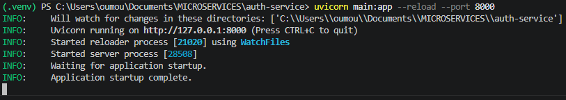

### Order-service démarré
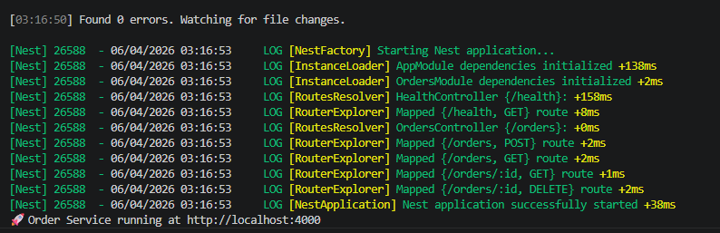

### Recipe-service démarré
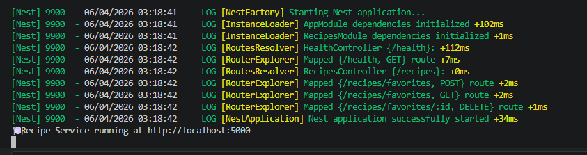

### Frontend démarré
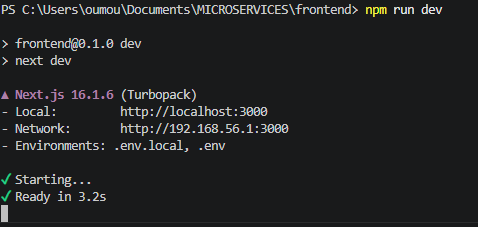

### Health checks en local
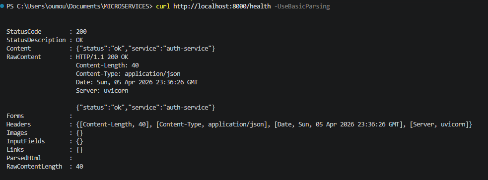
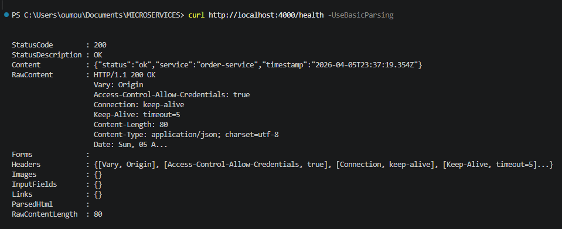
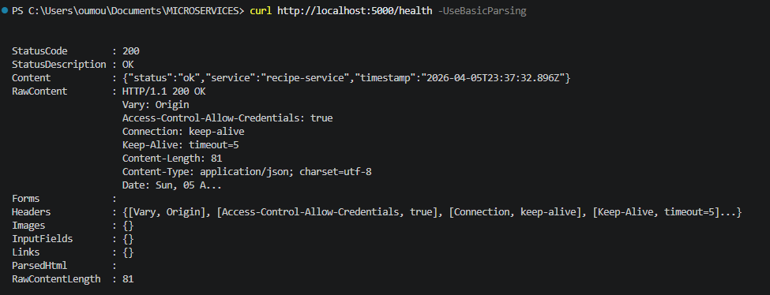
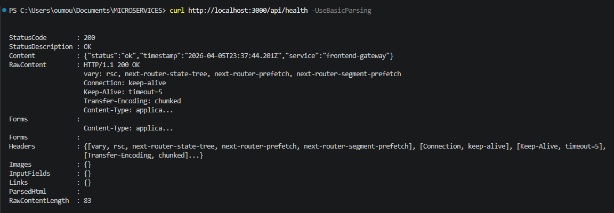

### Page recettes en local (localhost:3000/recipes)
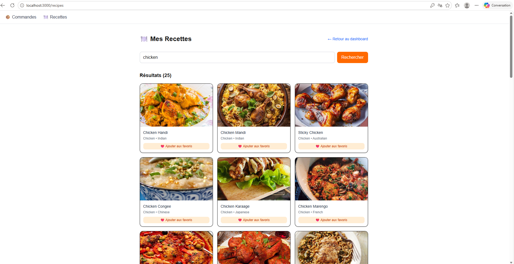

### Favoris en local
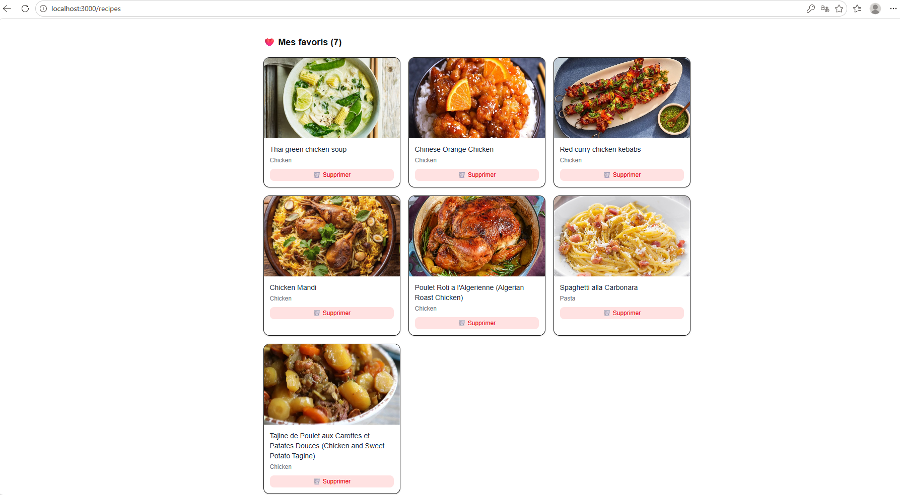

---

## Docker Compose

Les 4 services sont définis dans `docker-compose.yml`. Le recipe-service a son propre volume `recipe_db_data` pour persister sa base SQLite. Les services communiquent entre eux via leurs noms de conteneurs Docker (`auth-service`, `order-service`, `recipe-service`).

```bash
docker-compose up --build -d
```

### Les 4 conteneurs démarrés
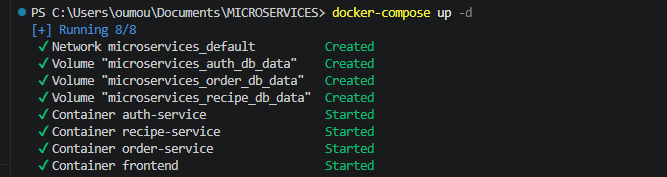


## Kubernetes avec Minikube

Les images sont publiées sur Docker Hub sous `oumoutoure`. Chaque service dispose d'un Deployment et d'un Service ClusterIP dans `k8s/`. L'accès externe passe par un Ingress Controller Nginx qui route `/auth` vers auth-service, `/orders` vers order-service, `/recipes/health` vers recipe-service, et tout le reste vers le frontend.

```bash
minikube start --driver=docker --cpus=2 --memory=3500mb
kubectl apply -f k8s/auth/
kubectl apply -f k8s/order/
kubectl apply -f k8s/recipe/
kubectl apply -f k8s/frontend/
kubectl apply -f k8s/ingress/
minikube tunnel
```

Ajouter dans `C:\Windows\System32\drivers\etc\hosts` :
```
192.168.49.2 devops.local
```

### Application des manifests Kubernetes
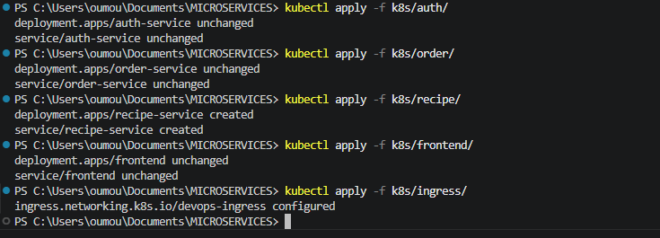

### Les 4 pods en Running
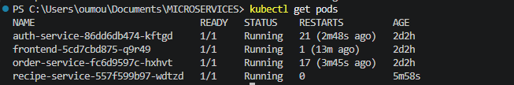

### Minikube tunnel actif
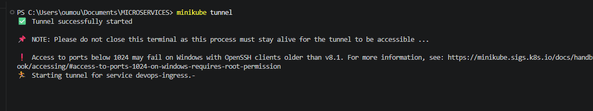

### Health checks via Ingress
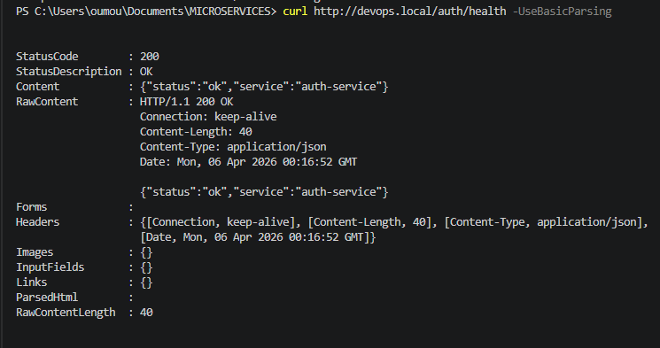
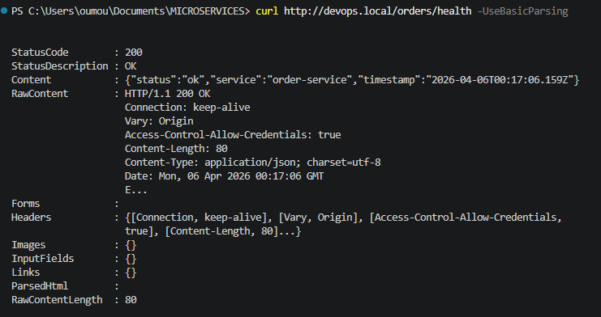
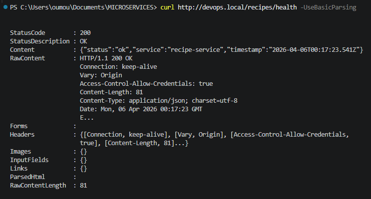

### Page recettes via Kubernetes (devops.local/recipes)
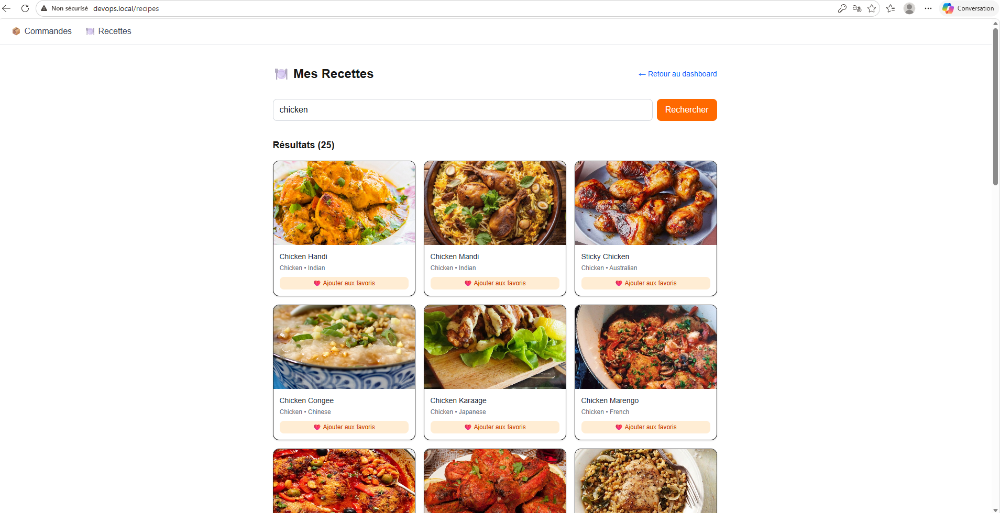


## Variables d'environnement

### auth-service
```env
DATABASE_URL=sqlite:///db/auth.db
JWT_SECRET=change-me
JWT_ALGO=HS256
ACCESS_TOKEN_EXPIRES_MIN=60
REFRESH_TOKEN_EXPIRES_MIN=43200
CORS_ORIGINS=http://localhost:3000
```

### order-service
```env
DATABASE_URL=file:./prisma/dev.db
JWT_SECRET=change-me
PORT=4000
```

### recipe-service
```env
DATABASE_URL=file:./prisma/dev.db
JWT_SECRET=change-me
PORT=5000
```

### frontend (.env pour Docker/Kubernetes)
```env
NEXT_PUBLIC_API_BASE=http://localhost:3000/api
AUTH_SERVICE_URL=http://auth-service:8000
ORDER_SERVICE_URL=http://order-service:4000/orders
RECIPE_SERVICE_URL=http://recipe-service:5000
```

### frontend (.env.local pour développement local)
```env
AUTH_SERVICE_URL=http://localhost:8000
ORDER_SERVICE_URL=http://localhost:4000/orders
RECIPE_SERVICE_URL=http://localhost:5000
```

## Routes API

### recipe-service
| Méthode | Route | Auth | Description |
|---------|-------|------|-------------|
| GET | /recipes/favorites | JWT | Retourne les favoris de l'utilisateur connecté |
| POST | /recipes/favorites | JWT | Sauvegarde une recette TheMealDB en favori |
| DELETE | /recipes/favorites/:id | JWT | Supprime un favori si il appartient à l'utilisateur |
| GET | /health |  | Retourne le statut du service |

